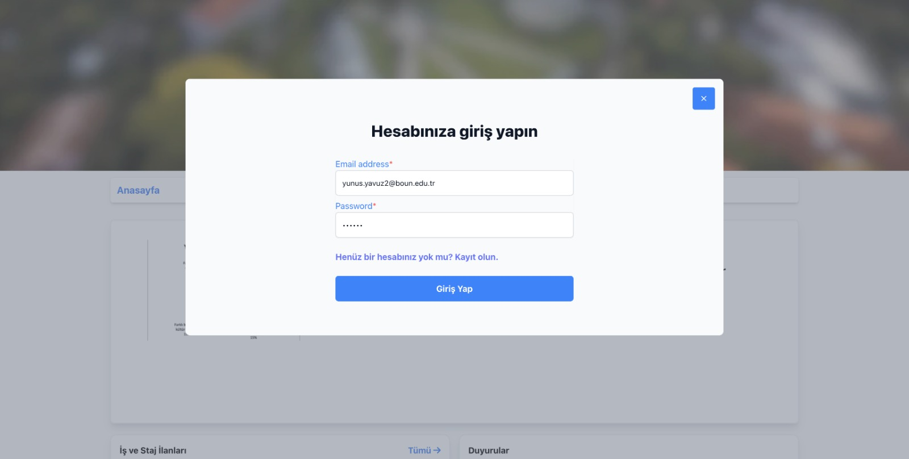
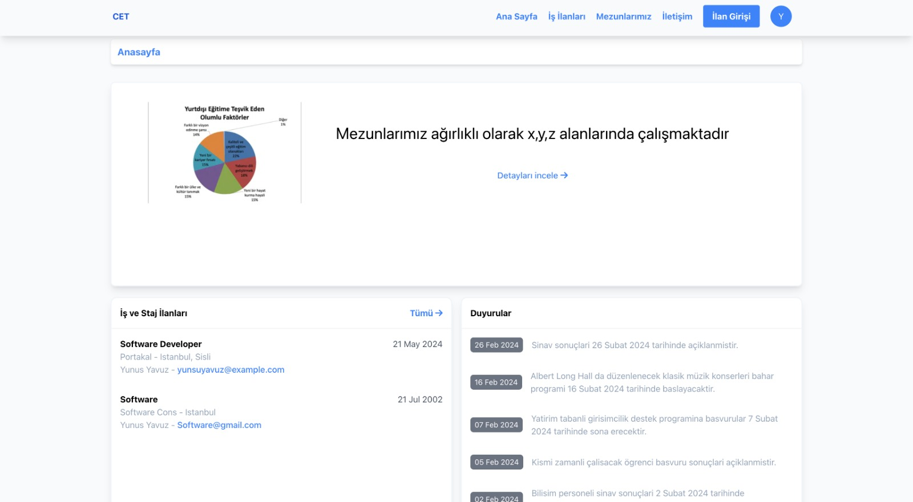
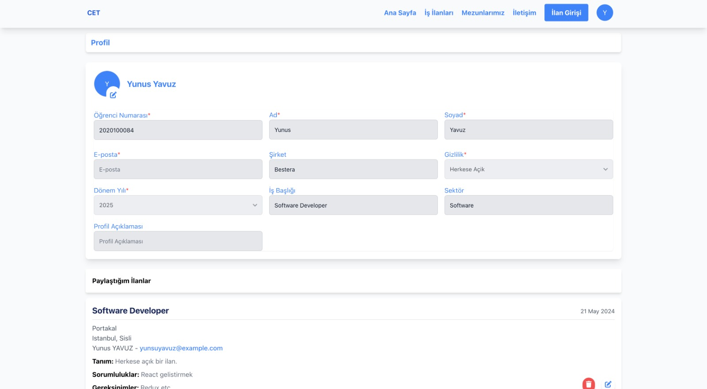
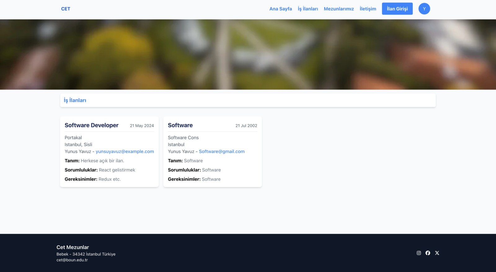
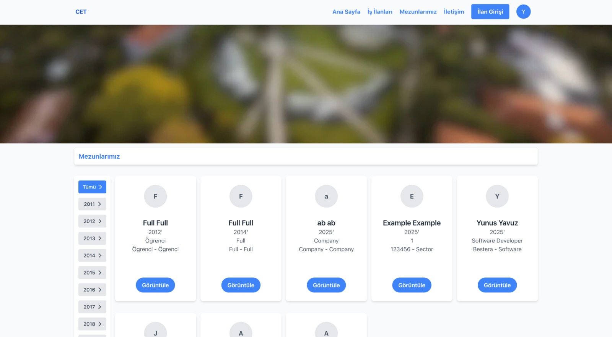

# Alumni Network Platform

✨✨✨ This project is a React-based web application developed using TypeScript and Vite. It serves as a platform for alumni to connect with each other through their profiles, job postings, and shared interests. The communication between users occurs through Gmail or via social media links shared in their profiles. The application includes several pages like login, register, profile, job postings, and alumni listing. ✨✨✨

## Table of Contents
- [Features](#features)
- [Screenshots](#screenshots)
- [Installation](#installation)
- [Technologies Used](#technologies-used)
- [Folder Structure](#folder-structure)
- [Usage](#usage)
- [Future Improvements](#future-improvements)

## Features
✨✨✨
- **Authentication**: Secure login and registration pages.
- **Profile Management**: Users can create and update their profiles, including sharing Gmail and social media links.
- **Job Postings**: Alumni can view job postings shared within the platform.
- **Alumni Directory**: A directory to view and connect with fellow alumni.
- **Error Handling**: Ensures smooth user experience through robust error boundaries.
✨✨✨

## Screenshots
✨✨✨ Below are the primary screens of the application: ✨✨✨

1. **Login Screen**


2. **Home Screen**


3. **Profile Screen**


4. **Job Postings Screen**


5. **Alumni Directory**


## Installation
✨✨✨ To run the project locally, follow these steps: ✨✨✨

1. Clone the repository:
   ```bash
   git clone https://github.com/your-repo-name.git
   ```

2. Navigate to the project directory:
   ```bash
   cd alumni-network-platform
   ```

3. Install the dependencies:
   ```bash
   npm install
   ```

4. Start the development server:
   ```bash
   npm run dev
   ```

5. Open your browser and go to:
   ```
   http://localhost:5173
   ```

## Technologies Used
✨✨✨
- **React**: Frontend framework for building user interfaces.
- **TypeScript**: For type safety and better developer experience.
- **Vite**: A fast build tool for modern web projects.
- **CSS**: For styling the application.
- **React Router**: For navigation and routing.
✨✨✨

## Folder Structure
✨✨✨
```
src
├── assets                # Images and static assets
├── components            # Reusable UI components
├── contexts              # Context providers for global state
├── hooks                 # Custom React hooks
├── layout                # Layout components for pages
├── models                # TypeScript type definitions
├── navigation            # Route configuration
├── pages                 # Main pages of the application
├── shared                # Shared utilities (auth, cookies, etc.)
├── store                 # State management (if applicable)
└── App.tsx               # Root component
```
✨✨✨

## Usage
### Authentication
✨✨✨
1. Users can register on the platform with their name, email, and password.
2. After logging in, they can complete their profiles by adding social media links or updating their Gmail.
✨✨✨

### Alumni Directory
✨✨✨
- Navigate to the Alumni Directory page to view other registered users.
- Profiles include details like names, photos, and contact options if shared.
✨✨✨

### Job Postings
✨✨✨
- Browse job postings to find new opportunities.
✨✨✨

### Profile Management
✨✨✨
- Users can edit their profiles to update contact information or add a profile picture.
✨✨✨

## Future Improvements
✨✨✨
- **Messaging Feature**: Enable direct communication between users within the platform.
- **Advanced Search**: Add filters and sorting options for job postings and alumni directory.
- **Mobile Responsiveness**: Optimize the UI for better usability on mobile devices.
- **Notification System**: Inform users about new job postings or profile views.
✨✨✨

---
✨✨✨ This project was developed as a volunteer effort for a class at Bogazici University. Contributions and feedback are welcome! ✨✨✨